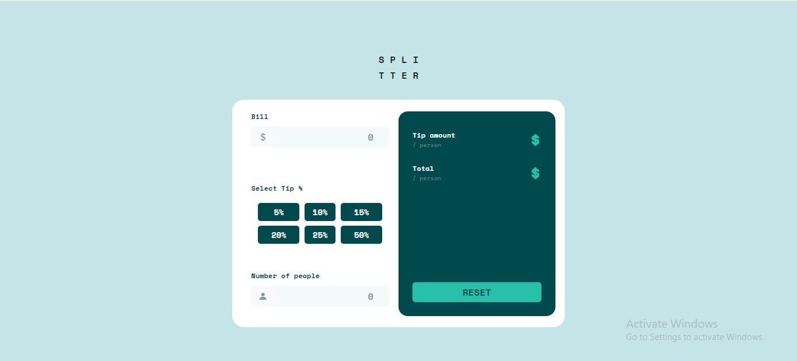
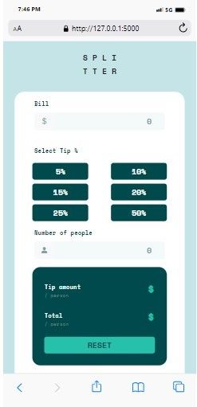

# Frontend Mentor - Tip calculator app solution

## Table of contents

- [Overview](#overview)
  - [The challenge](#the-challenge)
  - [Screenshot](#screenshot)
  - [Links](#links)
- [My process](#my-process)
  - [Built with](#built-with)
  - [What I learned](#what-i-learned)
- [Author](#author)


## Overview

### The challenge

Users should be able to:

- View the optimal layout for the app depending on their device's screen size
- See hover states for all interactive elements on the page
- Calculate the correct tip and total cost of the bill per person

### Screenshot





### Links

- Solution URL: [Add solution URL here](https://your-solution-url.com)
- Live Site URL: [Add live site URL here](https://your-live-site-url.com)

## My process

### Built with

- Semantic HTML5 markup
- CSS custom properties
- Flexbox
- CSS Grid
- Mobile-first workflow
- [Flask](https://flask.palletsprojects.com/en/2.3.x/) - Python web framework
- [Bootstrap 5](https://getbootstrap.com/) - For styles

### What I learned
I learnt how to style a radio button that is on checked


```css
input[type="radio"]:checked+label {
    color: hsl(183, 100%, 15%);
    background-color: hsl(172, 67%, 45%);
}

```


## Author
- Github - [@akinwumi-sa](https://github.com/akinwumi-sa/)
- Frontend Mentor - [@akinwumi-sa](https://www.frontendmentor.io/profile/akinwumi-sa)
- Twitter - [@akinwumi_sa](https://www.twitter.com/akinwumi_sa)
